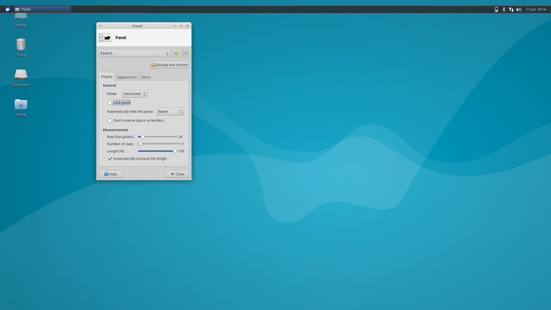
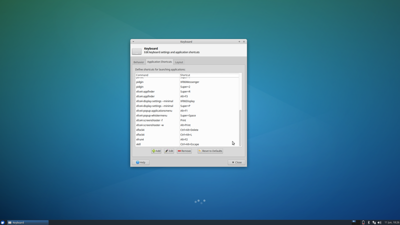
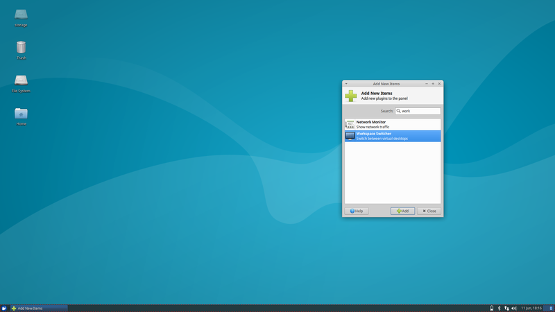
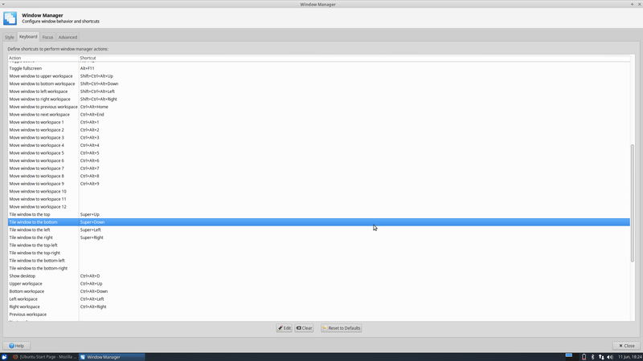
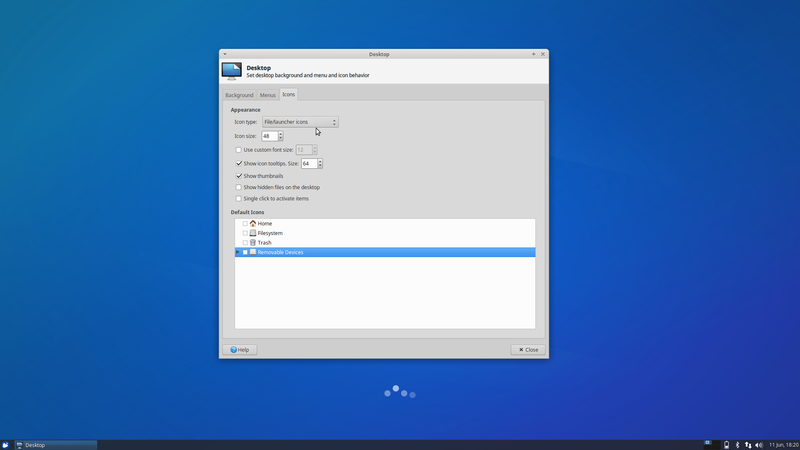
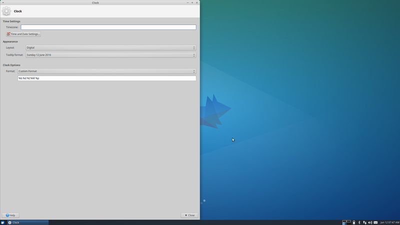
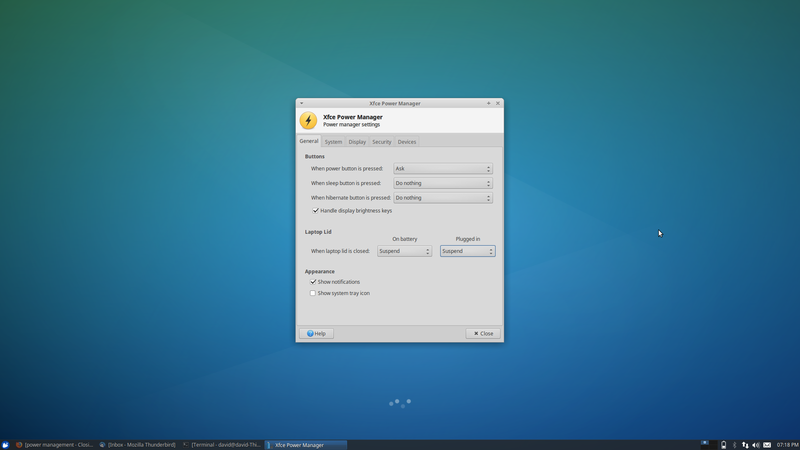
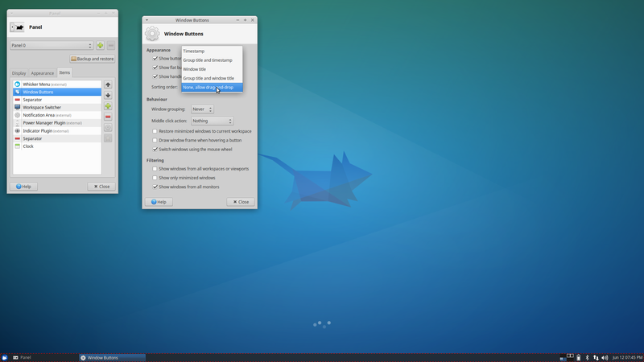

# Xubuntu 16.04 Setup

This guide describes how I setup [Xubuntu](http://xubuntu.org/). The guide is primarily for me to remember what I did in case I should have to do it again. However, others may find it useful as well. The guide is more of a series of prompts and less of a step my step explanation.

## Setup XFCE

[XFCE](http://www.xfce.org/) is Xubuntu desktop environment. Personally, there are a few tweaks that I think make Xubuntu easier to work in.

### Move Panel
Right click on the panel, select panel preferences, and deselect 'Lock Panel'. Grab the handle on the side of the panel and drag it to the bottom. The panel can then be relocked.

### Set Keyboard Shortcut of Whiskermenu
Make the application selector start with Super+Space. The application selector allows applications to be searched and then run by hitting enter.

### Add Workspace Switcher to Panel
The workspace switcher shows a preview of all the workspaces and the current workspace. One can edit the workspace configuration by right clicking on the workspace switcher and selecting Properties.

### Set Window Keyboard Shortcuts
Setup move windows to workspace and snapping windows keyboard shortcuts.

### Remove Desktop Icons
Deselect the items to be removed.

### Set Date Time Format
Right click on the date time and select Properties.

### Suspend On Close

### Allow Reordering of Tabs in Panel

### Use Nvidia Graphics Card Driver

### Fix Brightness Controls
After switching to the Nvidia graphics card driver the brightness controls on my laptop stopped working. This [site](http://askubuntu.com/questions/76081/brightness-not-working-after-installing-nvidia-driver) provides an easy fix.
>\> sudo mousepad /usr/share/X11/xorg.conf.d/10-nvidia-brightness.conf

Paste the following into the file:

    Section "Device"
        Identifier     "Device0"
        Driver         "nvidia"
        VendorName     "NVIDIA Corporation"
        BoardName      "Quadro K1000M"
        Option         "RegistryDwords" "EnableBrightnessControl=1"
    EndSection

## Setup .bashrc
Add the following lines to the .bashrc file

* Change terminal prompt

    PS1="\\[\\033[01;34m\\] \\w \\[\\033[01;32m\\]> \\[\\033[00m\\]"

## Git
* Install

>\> sudo apt install git

* Configure

>\> git config --global user.name "John Doe"

>\> git config --global user.email johndoe@example.com

* Aliases

>\> git config --global alias.lg "log --color --graph --pretty=format:'%Cred%h%Creset -%C(yellow)%d%Creset %s %Cgreen(%cr) %C(bold blue)<%an>%Creset' --abbrev-commit"

## Sublime Text 3
Download [deb package](https://www.sublimetext.com/3).
>\> sudo dpkg -i DEB_PACKAGE

### Installed Packages
* [Package Control](https://packagecontrol.io/installation)

### User Settings Additions
Keep from reloading last session:

    "hot_exit": false,
    "remember_open_files": false

## Other Software

* Keepassx - password manager
>\> sudo apt install keepassx

* ReText - markdown editor
>\> sudo apt install retext
