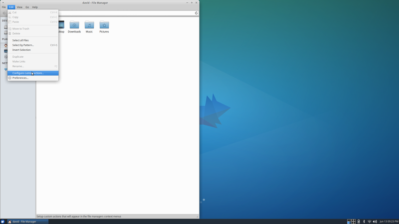
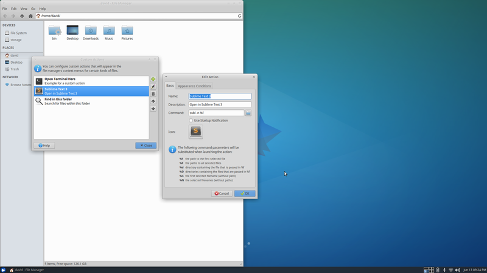
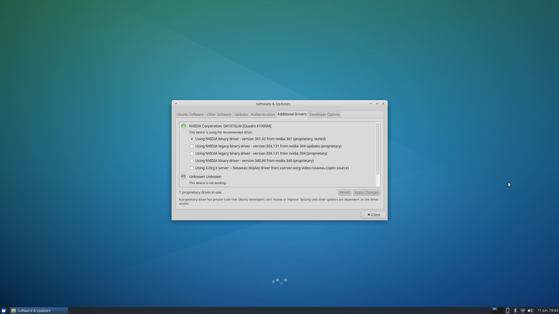

# Xubuntu 16.04 Setup

This guide describes how I setup [Xubuntu](http://xubuntu.org/). The guide is primarily for me to remember what I did in case I should have to do it again. However, others may find it useful as well. The guide is more of a series of prompts and less of a step my step explanation. Some of the images are hard to read, but the original images are available in the 'original_images' directory.

## Setup XFCE

[Xfce](http://www.xfce.org/) is Xubuntu's desktop environment. Personally, there are a few tweaks that I think make Xubuntu easier to work in.

### Move Panel
Right click on the panel, select panel preferences, and deselect 'Lock Panel'. Grab the handle on the side of the panel and drag it to the bottom. The panel can then be relocked.

### Set Keyboard Shortcut of Whiskermenu
Make the application selector start with Super+Space. The application selector allows applications to be searched and then run by hitting enter. Many of the configuration menus shown in subsequent images can be reached by searching for the window title with this tool.

### Add Workspace Switcher to Panel
The workspace switcher shows a preview of all the workspaces and the current workspace. Items can be added to the panel by right clicking on it and then selection 'Panel -> Add New Items...'. One can edit the workspace configuration by right clicking on the workspace switcher and selecting Properties.

Disable workspace wraping.

### Set Window Keyboard Shortcuts
Setup move windows to workspace and snapping windows keyboard shortcuts.

### Remove Desktop Icons
Deselect the items to be removed.

### Set Date Time Format
Right click on the date time and select Properties. Use the custom format '%b %d %I:%M %p'.

### Suspend On Close

### Allow Reordering of Tabs in Panel

### Custom Actions
Create custom actions for files or folders in file explorer.

Add Sublime Text option.

### Use Nvidia Graphics Card Driver

### Fix Brightness Controls
After switching to the Nvidia graphics card driver the brightness controls on my laptop stopped working. This [site](http://askubuntu.com/questions/76081/brightness-not-working-after-installing-nvidia-driver) provides an easy fix.
>\> sudo mousepad /usr/share/X11/xorg.conf.d/10-nvidia-brightness.conf

Paste the following into the file:

    Section "Device"
        Identifier     "Device0"
        Driver         "nvidia"
        VendorName     "NVIDIA Corporation"
        BoardName      "Quadro K1000M"
        Option         "RegistryDwords" "EnableBrightnessControl=1"
    EndSection

## Setup .bashrc
Add the following lines to the .bashrc file

* Change terminal prompt

    PS1="\\[\\033[01;34m\\] \\w \\[\\033[01;32m\\]> \\[\\033[00m\\]"

## Git
* Install

>\> sudo apt install git

* Configure

>\> git config --global user.name "John Doe"

>\> git config --global user.email johndoe@example.com

>\> git config --global diff.tool meld

>\> git config --global merge.tool meld

* Aliases

>\> git config --global alias.lg "log --color --graph --pretty=format:'%Cred%h%Creset -%C(yellow)%d%Creset %s %Cgreen(%cr) %C(bold blue)<%an>%Creset' --abbrev-commit"

## Sublime Text 3
Download [deb package](https://www.sublimetext.com/3).
>\> sudo dpkg -i DEB_PACKAGE

### Installed Packages
* [Package Control](https://packagecontrol.io/installation)
* Rust
* RustAutoComplete

### User Settings Additions
Keep from reloading last session:

    "hot_exit": false,
    "remember_open_files": false

## Other Software

* Keepassx - password manager

>\> sudo apt install keepassx

* Chromium - web browser

>\> sudo apt install chromium-browser

* [Vivaldi](https://vivaldi.com/download/?lang=en_US) - web browser
    * Double click on .deb package to open and select install

* Virtual Box - Virtual machine manager
    * [Free Windows VMs](https://developer.microsoft.com/en-us/microsoft-edge/tools/vms/)

>\> sudo apt install virtualbox

* ReText - markdown editor

>\> sudo apt install retext

* Meld - diff tool

>\> sudo apt install meld

* Rust - programming language

>\> curl -sf -L https://static.rust-lang.org/rustup.sh | sh

>\> cargo install racer # Rust autocomplete

* Calibre - ebook client

>\> sudo apt install calibre

* TexMaker - latex tool

>\> sudo apt install texmaker

* A US Dictionary - set the dictionary option in texmaker to '/usr/share/hunspell/en_US.dic'

>\> sudo apt install myspell-en-us

* Sound Converter- tool for converting to audio files

>\> sudo apt install soundconverter

* Other

>\> sudo apt install curl

>\> sudo apt install libssl-dev
